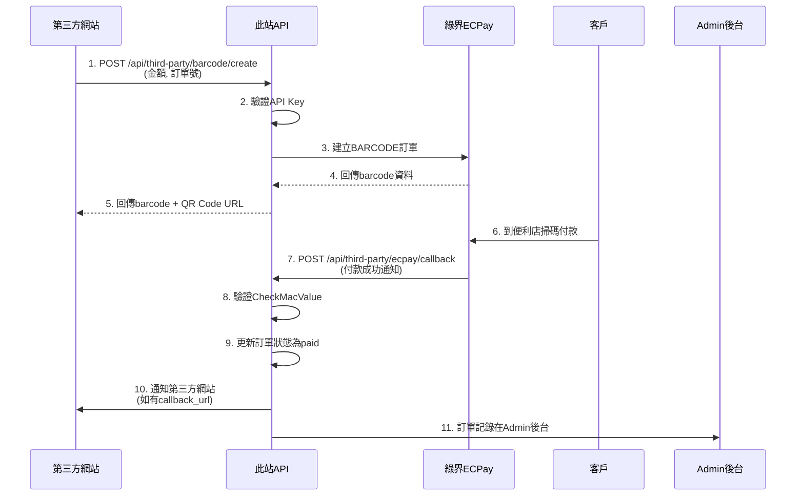

# 四方金流代收 BARCODE 流程圖

## 流程圖



## 流程說明

### 1. 訂單建立階段
- **第三方網站發起請求**：透過 API 傳送金額和訂單號
- **API Key 驗證**：系統驗證請求的合法性
- **建立 BARCODE 訂單**：向綠界 ECPay 發送建立條碼請求
- **取得條碼資料**：綠界回傳條碼和相關資訊
- **回傳給第三方**：將條碼資料和 QR Code URL 回傳

### 2. 付款階段
- **客戶付款**：客戶至便利商店掃描條碼完成付款
- **付款通知**：綠界通知系統付款已完成

### 3. 處理階段
- **驗證簽章**：確認回調的真實性（CheckMacValue）
- **更新狀態**：將訂單狀態更新為已付款
- **通知第三方**：若有設定 callback_url，通知第三方網站
- **後台記錄**：所有訂單資料都會記錄在 Admin 管理後台

## API 端點說明

### 建立訂單
- **端點**: `POST /api/third-party/barcode/create`
- **認證**: X-API-Key header
- **參數**:
  - `amount`: 金額 (1000-10000)
  - `client_order_id`: 客戶訂單編號
  - `callback_url`: 付款完成回調網址（選填）

### 查詢訂單
- **端點**: `GET /api/third-party/orders/{order_id}/status`
- **認證**: X-API-Key header
- **回應**: 訂單狀態、金額、付款資訊等

### 綠界回調
- **端點**: `POST /api/third-party/ecpay/callback`
- **認證**: CheckMacValue 簽章驗證
- **自動處理**: 更新訂單狀態、通知第三方

## 轉換為其他格式

### 轉換為 PDF
1. 使用支援 Mermaid 的 Markdown 編輯器（如 Typora、VS Code + Mermaid 插件）
2. 開啟此檔案後匯出為 PDF

### 轉換為 PNG/SVG
1. 訪問 [mermaid.live](https://mermaid.live)
2. 貼上上方的 mermaid 程式碼
3. 點擊下載按鈕選擇 PNG 或 SVG 格式

### 使用命令列工具
```bash
# 安裝 mermaid-cli
npm install -g @mermaid-js/mermaid-cli

# 轉換為 PNG
mmdc -i payment-flow-diagram.md -o payment-flow-diagram.png

# 轉換為 PDF
mmdc -i payment-flow-diagram.md -o payment-flow-diagram.pdf
```

---

建立時間：2024-01-XX
版本：1.0
